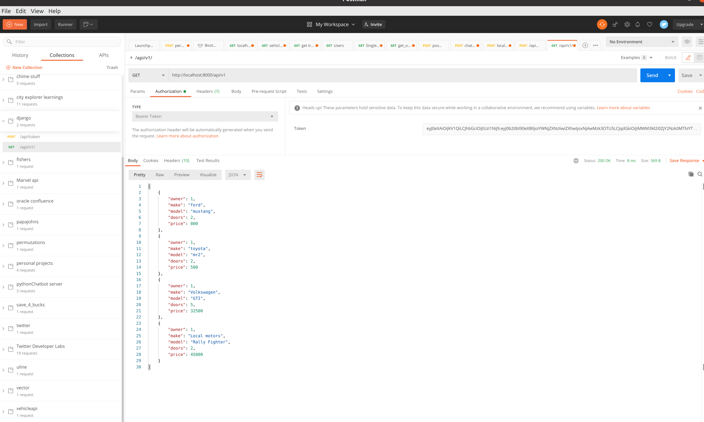

# Django authentication and prod servers (JWT lab)

Lab33 - Django Permissions and postgres

*Author: Lee-Roy King*

----

## Description
This is a Django web server which will expose an api for updating cars in a garage as well as controlling which users can update which vehicles (only owner can update or delete vehicles) this will also allow authentication using JWT

---

### Getting Started
Clone this repository to your local machine.

```
$ git clone git@github.com:leeroywking/django_perms_prod.git
```

### To run the program from VS Code:
`docker-compose up`

---
### images


### Change Log
1.0: Feature complete
1.1: Readme updates